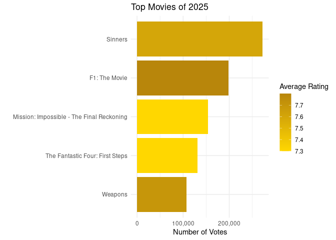

Please check the Rmd version of my step by step analysis with RStudio and Posit.

TASK: Answer question 'what to watch?'

DATA: IMDb non-commercial database

ENVIRONMENT:

- RStudio Desktop

- Posit Cloud

- Tidyverse

PROCESS:

During this analysis I imported and merged two .tsv datasets,

performed data cleaning tasks such as mutating data types and hard filtering using R.

I also created a sweet vizualization with the top 5 movies to watch in 2025.
